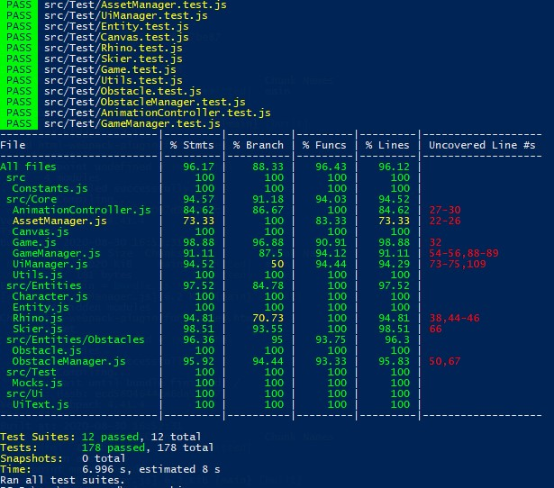

# Ceros Ski Code Challenge

Welcome to my application for the Ceros Code Challenge - Ski Edition!

As you guys may already know, you can test this project by running:
```
npm install
npm run dev
```

OR

ar [https://ceros-ski.azurewebsites.net](https://ceros-ski.azurewebsites.net)

**Challenge fundamentals**

* Good design/architecture;
* Code quality;
* Observe potential improvements;

**Bug fixing**

  As it was stated, there was a bug on the game which I solved by making the correct handling of the crash state of the skier. The original task asked to solve the problem for the left arrow key but I made it work for both left and right arrow keys.

  I also implemented a few unit tests to help avoid this problem to happen again.

**Extending existing functionality**

  For this task, I made the skier do a simple jump when pressing the **SPACE BAR** key. Also, if the skier hits a ramp, it will do an awesome front flip with a little chance of a back flip.

  There was some sprites that looked misplaced to me (*skier_jump_2*, *skier_jump_3* and *skier_jump_4*), so I switched places for the animation to look better.
   
**Building something new**

  The mighty rhino is here!
  The game now has a angry rhino chasing the player down the mountain. It can run to the left, to the right and downwards. If it catches the player, you are done.
  
* The rhino appears after a specific amount of time and at a specific distance from the player;
* The rhino runs faster then the player when both are going downwards but the player goes faster if slides on diagonal, adding some challenge to the game forcing the player to move on diagonals to outrun the rhino;
* The rhino sprites were scaled up to 128px height to bring consistency with the skier being eaten size and to look more scary;
* The rhino received a new animation to run to the right. It was possible to flip the sprite by code but having a dedicated sprite is more performant;
* I used the last two frames from the rhino sprites to create a "celebrate" animation.

**Documentation:**

  This readme file is being updated along with the implementation itself.

**Bonus**

Checklist of suggested bonus items:

- [X] Provide a way to reset the game once it's over
- [X] Provide a way to pause and resume the game
- [X] Add a score that increments as the skier skis further
- [X] Increase the difficulty the longer the skier skis (increase speed, increase obstacle frequency, etc.)
- [X] Deploy the game to a server so that we can play it without having to install it locally
- [X] Write more unit tests for your code

----
**Extra thoughts**

***The canvas***

The canvas was centralized to avoid scrollbars;

***Game Manager***

The project received a Game Manager singleton to control global aspects of the game like state, time and score. I put the **HIGHSCORE** mechanism on the game manager itself but In a more structured project would be better to create a **StorageManager** to handle localstorage, sessionstorage and cookie manipulation.

***UI Manager***

For the Ui, I created a UiManager class to handle all OSD information.

The screen was separated in 9 blocks:

|   |   |   |
|:---|:---:|---:|
| Top Left | Top Center | Top Right |
| Left | Center | Right |
| Bottom Left | Bottom Center | Bottom Right |


The UiManager can handle blocks of information in one of these screen blocks and automatically calculates text position based on text order and block height.


***Animation Controller***

The Animation Controller is responsible for controling the characters animation. It receives the animation and a few instructions on how to handle the animation and is good to go. To improve from here, would be nice to get assets ONLY from the Animation Controller, even if the animation has only a single frame for consistency.


***Testing***

I added the package *jest-canvas-mock* to be able to test the HTML5 canvas element.

Here are the test coverage for the result:
<p align="center">
  
</p>
